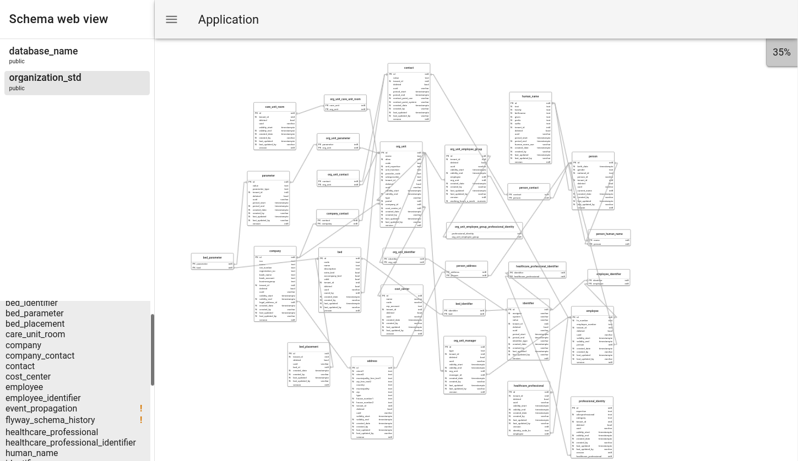

# db-schema-web-view
Provides web view over database schema, displays: 
 - tables
 - columns
 - primary keys
 - foreign keys with relations to the tables
 - unique constraints (hover over table name to display more information to the table)

Tables are distributes using d3-force simulation in a way that related tables are attracted together. Database connections are loaded from connections.yaml.

## Supported databases
 - Postgresql



## Development
Update connections.yaml to point to a local database.

Start go backend
```shell
go mod download
go build .
```

Start web application
```shell
cd _webapp
npm install
npm run serve
```

## Docker
To build a docker image first update your connections.yaml file and _webapp/.env.production url to point to a domain/IP where container will be running. 
Run build.sh script to build frontend and backend applications. 

Build docker image 
```shell
docker build . -t db-schema-web-view:latest
```
Run docker image 
```shell
docker run --publish 9090:9090 db-schema-web-view:latest
```
Go to http://localhost:9090 and you should see the application.